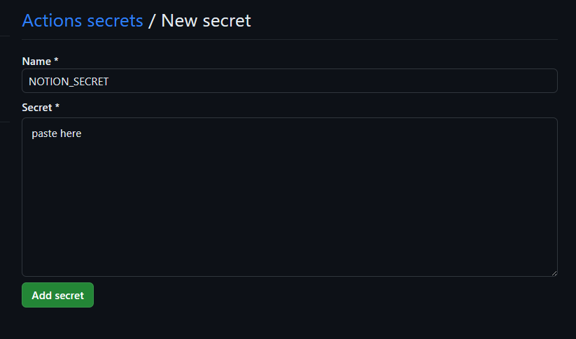
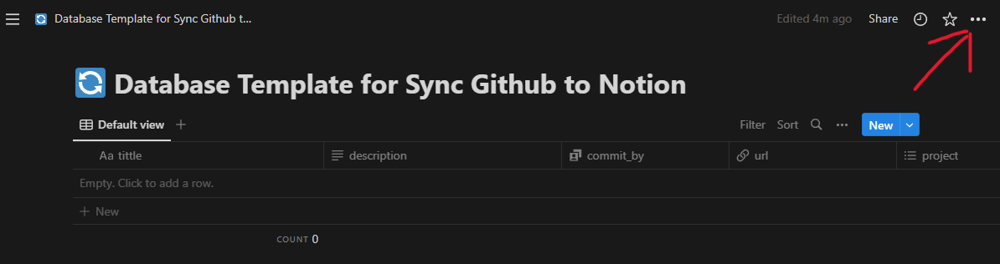
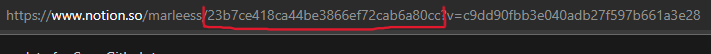
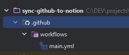

# S**ync Github Commit to Notion**

This action reference from [alessandrobelli/NotionHook](https://github.com/alessandrobelli/NotionHook)

---

## Setup

1. Create a new private Notion integration here: [https://www.notion.so/my-integrations](https://www.notion.so/my-integrations).
2. Copy the "Internal Integration Token" and create a new Repository secret called `NOTION_SECRET`.
    1. Go to repository **Settings.**
    2. Select **Secrets and variables**, on the drop-down select **Actions**.
    3. Click button  ****************************************New repository secret**************************************** .
    4. And paste your Internal Integration Token.

       

3. [You need to create a new Notion Database that looks like this, or just duplicate this.](https://www.notion.so/23b7ce418ca44be3866ef72cab6a80cc?pvs=21)
4. Connect page to **********************Github**********************
    1. Select the menu in the top right corner.

       

    2. Select **Add Connection** and choose **********************Sync Github**********************
5. Navigate to your Notion database in a browser and get the Database Id and copy.

   

6. Create a new Repository secret for `NOTION_DATABASE`, the same way as number 2.
7. Create **yaml** file in directory **************.github/workflows/main.yml************** on your porject.
    1. Like this

       

    2. Copy this and paste it in **main.yml**

        ```yaml
        on: [push]
        
        jobs:
          build-node:
            runs-on: ubuntu-latest
            name: Sync commits to Notion
            steps:
              - name: Sync Github Commit to Notion
                id: notion-sync-commit
                uses: marlisumarli/sync-github-to-notion@1.0.1
                with:
                  notion_secret: ${{ secrets.NOTION_SECRET }}
                  notion_database: ${{ secrets.NOTION_DATABASE }}
                  token: ${{ secrets.TOKEN }}
        ```
